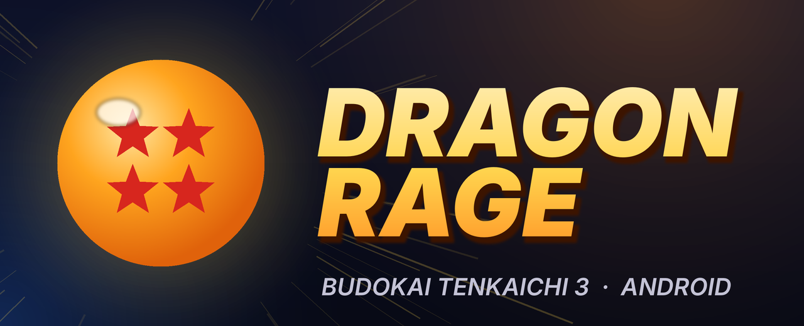

<p align="center">
  
</p>

<p align="center">
  <b>Dragon Ball Z: Budokai Tenkaichi 3, running natively on Android.</b><br>
  An Android port of <a href="https://github.com/z3xox/Tenkaichi3Decomp">Tenkaichi3Decomp</a>, the native PC port built on the BT3 decompilation.
</p>

<p align="center">
  <a href="../../releases"></a>
  <a href="../../actions/workflows/android.yml"></a>
  
</p>

---

> [!IMPORTANT]
> **Status: the engine builds for arm64 and ships in the APK; first tests on a device are under way.**
> The whole game (332 source files: the decompiled game, the PC port's platform layer, renderer, sound) compiles
> and links for Android arm64, with the game's 32-bit pointers and the PS2's float arithmetic intact. Whether it
> boots, and how well it runs, is being found out on real hardware right now. See [Roadmap](#roadmap).

This repository contains **no game data**. You need your own copy of the **USA release (SLUS-21678)** as an
`.iso`. The app reads it on your device; nothing is downloaded or uploaded.

## What it is

The PC port is not an emulator: it is the game's own code, decompiled and compiled for PC, with a new renderer,
sound and input layer underneath. Dragon Rage brings that to Android in two parts:

| Part | Where | State |
|---|---|---|
| **Launcher app** (Kotlin, Jetpack Compose, Material 3; English and Portuguese) | [`android/`](android) | ✅ Done |
| **Game engine** (the port's C code, built for arm64 as `libbt3.so`) | `src/`, `include/`, `port/` | 🧪 Builds and links; testing on devices |

## The app

<table>
<tr><td><b>Home</b></td><td>Pick your ISO. The app checks it is the unmodified USA release (the same SHA-1 checks as the PC setup) and unpacks the game data in the layout the engine expects. Play button.</td></tr>
<tr><td><b>Textures</b></td><td>Import a texture pack as a <code>.zip</code>. Packs made for PCSX2 (<code>.dds</code> / <code>.png</code>) work as they are. Turn each pack on or off, or all of them at once.</td></tr>
<tr><td><b>Mods</b></td><td>File-replacement mods as <code>.zip</code> (with a priority order), extra stages (<code>.unk</code>) and extra songs (<code>.adx</code>), with the name shown in the game's menus editable.</td></tr>
<tr><td><b>Cheats</b></td><td><i>Unlock everything</i>: every character, stage, song and item, and max Zeni. This is the debug function the developers left in the game. It is applied the next time the game starts.</td></tr>
<tr><td><b>Settings</b></td><td>Internal resolution 1x–8x, aspect ratio (4:3 to 32:9), each of the five PS2 effects (outline, see-through tint, depth tint, glow, distance blur), glow strength, music / voice volume, on-screen controls, theme, Material You colours.</td></tr>
</table>

Dark theme with Dragon Ball colours (Goku's gi orange and blue, dragon-ball amber, Super Saiyan gold) by default,
or your wallpaper's colours with Material You. On wide screens (handhelds like the AYN Odin) the navigation moves
to a side rail.

### Install

Download the APK from [Releases](../../releases) and install it, or build it yourself:

```sh
cd android
./gradlew installDebug        # needs JDK 17+ and the Android SDK (compileSdk 35)
```

### Where files go

Everything lives in `Android/data/com.dfdx047.dragonrage/files/`, in **the same layout the PC port uses next to
its program**, so the engine will run with that folder as its working directory without Android-specific paths:

```
gamedata/            the unpacked disc (disc/, pzs3us0/, pzs3us1/, pzs3us2/, .installed)
gamedata/mods/       replaced files (rebuilt by the app from modlib/)
textures/            active texture packs (any depth)      textures_off/   packs switched off
stages/  songs/      extra stages and songs (maps.txt / songs.txt hold the menu names)
saves/               memory card
bt3_settings.txt     engine settings (name=number lines)
modlib/              the app's mod library
```

New keys in `bt3_settings.txt` for the Android side of the engine to read: `dr_unlock_all` (1 = run the unlock once
at start, then reset to 0), `dr_touch` (on-screen controls: 0 off, 1 automatic, 2 always), `dr_touch_alpha`
(opacity %), `dr_fps60` (reserved).

## Roadmap

### Done
- [x] Launcher app: game-data install from ISO with checksum verification, texture packs, mods, extra
      stages and songs, unlock-all cheat, all engine settings, Material 3 theme
- [x] CI: every push builds the APK; an `android-v*` tag publishes a release

### The engine on arm64

How it works:

- **32-bit pointers.** The game stores pointers in 32-bit fields everywhere; the PC port's 64-bit build marks every
  game pointer `__ptr32` (`port/tools/ptr32.py`). Clang supports that on AArch64 since LLVM 20, so the engine is
  built with upstream **LLVM 21**; `irfix.py` makes the same repairs as on x86-64.
- **The PS2's float arithmetic.** Game code is built for the soft-float ABI (`-mabi=aapcs-soft -mgeneral-regs-only`),
  so every float operation still goes through `port/src/softfloat_ps2.c`, bit for bit what the PS2 does: the fights
  play out exactly as on the PC port.
- **Memory below 4 GB.** The program is linked at a fixed address (0x03000000, below an Android app's Java heap) and
  marked as a shared object; `android/app/src/main/cpp/loader.c` reserves that range and has Android's own loader
  load it there (`android_dlopen_ext`). The game's heap, stack and the port's region sit around it, all under
  0x12C00000.
- **SDL3** (Vulkan through SDL's GPU API, audio, controllers) with SDL's Android activity, in a process of its own.

Build it: `sh port/tools/android_toolchain.sh` (LLVM 21, the NDK's sysroot, SDL3), then
`BT3_SKELETON=1 python3 port/tools/android.py` (engine, loader, copied into the app), then `./gradlew` in `android/`.
CI does the same on every push and publishes the result as the
[android-nightly](../../releases/tag/android-nightly) pre-release.

- [x] Engine builds and links for arm64 (332 of 332 sources)
- [x] Loader, game activity, Play button; logs to logcat (`adb logcat -s bt3`) and `bt3_log.txt`
- [x] Unlock-all from the app; the back button opens the in-game settings
- [ ] **Boots and plays on a device** (testing now)
- [ ] Performance on mobile GPUs; DDS (BC1–BC3) texture packs on GPUs without BC support
- [ ] Touch controls; pause/resume
- [ ] Save states and online rollback on arm64 (`port/src/gs/state.c` uses `getcontext`, which Android lacks)

### Later
- [ ] **60 fps mode.** The game runs its logic at 30 fps; a real 60 fps needs changes to the simulation's timing.
- [ ] Online play (the PC port has rollback netplay).

## Repository layout

| Path | Contents |
|---|---|
| `android/` | **Dragon Rage**, the Android app (Gradle project) |
| `src/`, `include/` | The game's code, from the decompilation; PC changes are inside `#ifdef PORT` |
| `port/` | The PC port: platform layer, renderer, sound, input, build tools |
| `docs/` | Notes on the game and on the PC port ([the PC port's original README](docs/port/upstream_README.md)) |

## Credits

- **[Tenkaichi3Decomp](https://github.com/z3xox/Tenkaichi3Decomp)** by z3xox: the native PC port this is built on,
  and the matching decompilation BT3-Decompiled under it. Contributors of the PC port are listed in its README.
- Dragon Rage (Android app and port): [dfdx047](https://github.com/dfdx047).
- Made with the help of AI.

## Licence

The Android app (`android/`) and the PC port's own code (`port/` except `port/third_party/`) are under the
[MIT licence](LICENSE). The libraries in `port/third_party/` keep their own licences. The game's code in `src/` and
`include/` comes from the decompilation and belongs to the game's rights holders.

## Legal

This project is not affiliated with or endorsed by the game's developers, publishers or rights holders. It exists
for preservation, study and interoperability, and distributes none of the game's assets. Dragon Ball and all
related names belong to their owners. You need your own legally obtained copy of the game.
